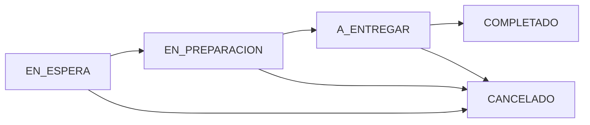

# Leny San Sushi - Restaurant Management System

 **Sistema completo de gestión para restaurante** con pedidos en tiempo real, panel administrativo y soporte multi-sucursal. Modernizando la experiencia del cliente y optimizando operaciones.

---

## Screenshots

### Páginas Públicas

### Menú Público

### Flujo de Pedidos Completo

### Panel Administrativo

### Mails
<table>
  <tr>
        <td></td>
        <td></td>
      <td></td>
      <td></td>
  </tr>
</table>

---

📋 <strong>Problema de Negocio & Solución</strong>

### 🎯 Problemas Identificados
- **Gestión Manual Ineficiente**: Cartas físicas desactualizadas, cambios de precios requieren reimpresión
- **Sistema de Pedidos Obsoleto**: Dependencia de llamadas telefónicas con errores frecuentes
- **Falta de Trazabilidad**: Sin seguimiento digital del estado de pedidos
- **Saturación Operativa**: Líneas telefónicas ocupadas = pérdida de ventas

### ✅ Solución Implementada
- **🏪 Gestión Digital**: Panel admin para actualizar menú, precios y disponibilidad en tiempo real
- **📱 Pedidos Automatizados**: Sistema web completo con validación geográfica de delivery
- **🔔 Notificaciones Tiempo Real**: SSE para alertas instantáneas a cocina y administración
- **📊 Dashboard Unificado**: Seguimiento completo desde "En Espera" hasta "Completado"
- **🌍 Multi-Sucursal**: Control independiente de operaciones AR/US

---

## 🛠️ Stack Técnico

<table>
<tr>
<td width="50%">

### Frontend
- **Framework**: Angular 19 (Standalone Components)
- **UI/UX**: Angular Material + SCSS
- **State**: RxJS Observables
- **Maps**: Google Maps, LocationIQ, Leaflet
- **i18n**: ngx-translate

</td>
<td width="50%">

### Backend
- **Framework**: Laravel 11 + Sanctum Auth
- **Database**: MySQL + Eloquent ORM
- **API**: RESTful + Resource Controllers
- **Real-time**: Server-Sent Events (SSE)
- **Payment**: Stripe Integration

</td>
</tr>
</table>

---

## 🏗️ Arquitectura del Sistema

### 📊 Flujo de Estados de Órdenes

## 🔧 Características Principales

### 🛒 **Sistema de Pedidos Completo**
- Selección delivery/pickup con validación geográfica
- Carrito persistente
- Checkout protegido con autenticación

### 🔔 **Notificaciones en Tiempo Real**
- Server-Sent Events (SSE) para updates instantáneos
- Dashboard administrativo con alertas
- Seguimiento de estados automático

### 🌍 **Multi-Sucursal (AR/US)**
- Control independiente por región
- Configuración específica de delivery y horarios

### 📊 **Panel Administrativo**
- Gestión de menú con sistema de backup
- Dashboard de órdenes en tiempo real
- Configuración de restaurante por sucursal
